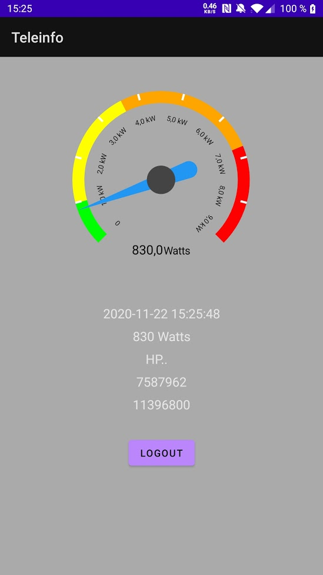

# TELEINFO ANDROID APP

This Android App uses data collected from [teleinfo-enphase-xev101-php-firebase
](https://github.com/vrobert78/teleinfo-enphase-xev101-php-firebase) and stored into [Google Firebase Realtime Database](https://firebase.google.com/products/realtime-database).

The app reflects in near-realtime your electricity consumption and represents it using a gauge.



## How to use

1. Clone the repo
2. Add a local.properties at the root containing something like
```
## This file is automatically generated by Android Studio.
# Do not modify this file -- YOUR CHANGES WILL BE ERASED!
#
# This file should *NOT* be checked into Version Control Systems,
# as it contains information specific to your local configuration.
#
# Location of the SDK. This is only used by Gradle.
# For customization when using a Version Control System, please read the
# header note.
sdk.dir=/pathToYour/Android/Sdk
```
3. Open the project using the [Android Studio](https://developer.android.com/studio)
4. Download your `google-service.json` that you'll find in parameters of your [Firebase project](https://console.firebase.google.com/u/0/)
5. Copy `google-service.json` in the app folder
6. Run on the emulator, your phone or build an APK


### Security
Don't forget to set some rules on your Realtime Database. You can limit access to your Google Account after the first login, that will give you your UID in the project.
After that, you can use a rule like:
```
{
  "rules": {
    ".read": "auth.uid == 'youruid'",
    ".write": false
  }
}
```
